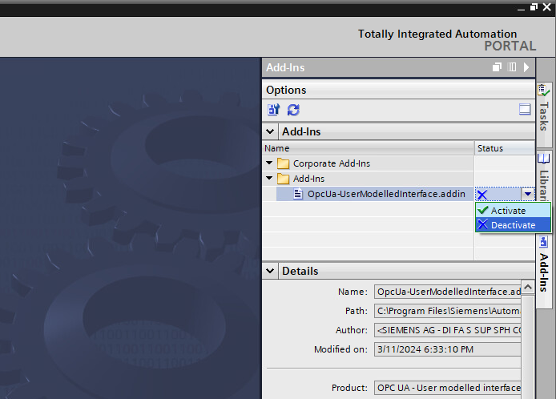

# OPC UA - User modelled interface - V1.0.0

## Description
This Add-In is designed to replicate the “Default SIMATIC Server Interface”, found in S7-1500 PLCs, as a user modelled interface using Openness. 

The main goals of this Add-In are:

- Enhanced performance: Replace the default SIMATIC server interface with modelled interfaces that offer improved performance, 5 to 6 times faster, when accessing data through the read, write, and subscribe services.
- Automatic interface generation for S7-1200 and S7-1500 R/H PLCs: Create server interfaces for S7-1200 and S7-1500 R/H PLCs, which do not support the default SIMATIC server interface.
- Customization to fit project needs: Provide flexibility by allowing customization of the server interface to meet specific project requirements. With the "Extend create" option, users can modify certain parameters of the server interface and adapt it to their needs.

## Table of contents

1. [Instalation](#instalation)
2. [Usage](#usage)
3. [How it works](#how-it-works)
4. [Tia Portal version](#tia-portal-version)
5. [Features](#features)

<a name="instalation"></a>
## Instalation

Follow these steps to carry out the instalation process:

1. Download the repository to the local machine.
2. Open Visual Studio, selecting the option: "Run as Administrator".
3. Ensure that all necessary references are included in the project **AddinOpcUaInterface**. If any references are missing, select the Openness DLL files from TIA Portal version V19 as your reference source.
4. Build the solution. The post-build event command will automatically transfer the .addin file to the **C:\Program Files\Siemens\Automation\Portal V19\AddIn** directory.

**NOTE:** If TIA Portal version V17 or V18 is being used, please refer to the instructions described in [Chapter 4](#tia-portal-version).

<a name="usage"></a>
## Usage
To use the Add-In in TIA Portal, make sure that the **OpcUa-UserModelledInterface.addin** file is located in the following directory: **C:\Program Files\Siemens\Automation\Portal V19\AddIns**. 

Then, proceed with the following steps:

1. Open a TIA Portal project and navigate to the Add-Ins tab on the right of the screen.
2. Activate the Add-In with the dropdown menu. 

    

3. Once activated, right-click on a device.
4. Place the cursor over the Add-In. The two possible actions, "Create" and "Extend create," will appear.

    


### Create
The "Create" option enables users to recreate the default SIMATIC server interface. This means that all configuration parameters are pre-set, and the user only needs to specify the name of the server interface, namespace URI, and a file path to store the XML file.

<div style="text-align:center">
    
</div>

### Extend create
The "Extend create" option allows users to customize the interface according to their specific requirements. Some of the options offered by this action include:
- Setting filters to define the access levels of nodes within the server's AddressSpace.
- Optimizing the server interface: Exclude children nodes from UDTs, structs, arrays, etc. In large projects, the number of nodes  can be significantly reduced to fit the server's maximum node limit.
- Choosing between strings or numeric identifiers for node identification: While the default SIMATIC server interface uses strings, numeric identifiers offer improved performance in terms of server storage and communication.
- Removing empty data blocks: This option enables the removal of data blocks that do not contain any accessible variables via OPC UA, thus reducing the number of nodes in the server's AddressSpace.
- Preserving the folder structure of the project: Folders present in the project can be included in the server interface. Maintaining the folder structure allows for easier browsing of the AddressSpace, although it increases the number of nodes.

<div style="text-align:center">
    
</div>

<a name="how-it-works"></a>
## How it works
The Add-In utilizes the Openness API to access information stored in the TIA Portal project. To create a user modeled interface, the Add-In follows these steps:
1. Imports an XML base template of the server as an XDocument.
2. Scans through all system and user datatypes in the project and includes them in the XDocument as UADataTypes and UAObjects.
3. Browses through the project's tag tables and adds all Tags to the server interface.
4. Repeats the previous step with the Global and Instance data blocks that are accessible via OPC UA.
5. Finally, the program exports the XDocument as an XML file, which is imported into TIA Portal to create the server interface.

<div style="text-align:center">
    
</div>

<a name="tia-portal-versions"></a>
## TIA Portal version

The Add-In is designed to run on TIA Portal V19, but it can be adapted to run on TIA Portal version V17 and V18. To do so:
- Update the references of the project **AddinOpcUaInterface**. Use the Openness DLL files from TIA Portal versions V17 or V18 as your reference source.
- Change the post-build event command to: 
    ```
    copy "$(ProjectDir)AddInPublisherConfig.xml" "$(TargetDir)AddInPublisherConfig.xml" /Y 
    "C:\Program Files\Siemens\Automation\Portal V19\PublicAPI\V17.AddIn\Siemens.Engineering.AddIn.Publisher.exe" -f "$(TargetDir)AddInPublisherConfig.xml" -l "$(TargetDir)PostBuildLog.txt" -v -c -o "C:\Program Files\Siemens\Automation\Portal V19\AddIns\OpcUa-UserModelledInterface.addin"
    ```
- Replace "UnrestrictedPermissions" with "SecurityPermissions" in the **AddInPublisherConfig.xml** file.

    Before:

        <RequiredPermissions>
            <TIAPermissions>
                <TIA.ReadWrite/>
            </TIAPermissions>
            <UnrestrictedPermissions>
                <System.UnrestrictedAccess>
                    <JustificationComment>
                        Needed for the execution of the "OPC UA - User Modelled Interface" Add-In
                    </JustificationComment>
                </System.UnrestrictedAccess>
            </UnrestrictedPermissions>
        </RequiredPermissions>
    After:

        <RequiredPermissions>
            <TIAPermissions>
                <TIA.ReadOnly/>
            </TIAPermissions>
            <SecurityPermissions>
                <System.Security.Permissions.UIPermission/>
                <System.Security.Permissions.FileIOPermission/>
                <System.Security.Permissions.SecurityPermission.UnmanagedCode/>
            </SecurityPermissions>
        </RequiredPermissions>

<a name="features"></a>
## Features

### Features included in this version of the Add-In
- "Create" and "Extend create" actions have been implemented.
- Access level filters: Safety parameters are set to read-only by default.
- Optimization of the server interface: The Add-In currently operates in "optimize" mode by default, excluding children nodes from UDTs, structs, arrays, etc.
- Removal of empty data blocks: To reduce the number of nodes.
- Folder structure management: Users can choose to keep or exclude the folder structure of the project.
- Log file: Maintains a record of nodes that have not been added to the server interface.

### Limitations

Some of the Add-In's current limitations are listed below:
- It is not possible to use the Add-In without the "optimize" mode.
- NodeIDs cannot be configured with numeric identifiers.
- Function Blocks instantiated within other Function Blocks are modelled as "UAObjects" instead of "UAVariables". Therefore, the variables contained inside nested FBs are not accessible via the generated interface. 

**DISCLAIMER:** This Add-In is designed to serve as a starting point for users to build upon. Users are encouraged to expand upon this basic version by implementing additional functionalities according to their specific requirements.

# Reference links

OPC UA communication:
- [SIMATIC S7-1500, ET 200MP, ET 200SP, ET 200AL, ET 200pro, ET 200eco PN Communication](https://support.industry.siemens.com/cs/document/59192925/simatic-s7-1500-et-200mp-et-200sp-et-200al-et-200pro-et-200eco-pn-communication?dti=0&lc=en-WW)

Openness API:
- [TIA Portal Openness: Automation of engineering workflows](https://support.industry.siemens.com/cs/document/109792902/tia-portal-openness-automation-of-engineering-workflows?dti=0&lc=en-WW)
- [TIA Add-Ins](https://support.industry.siemens.com/cs/document/109773999/tia-add-ins?dti=0&lc=en-WW)
